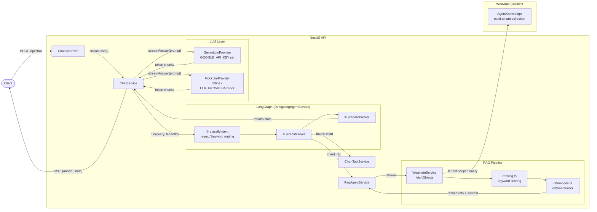

# nestjs-weaviate

Backend-only demo: **NestJS** + **Weaviate** (multi-tenant collection) + **LangGraph** delegating agent + **LangChain** (Gemini when configured) + **SSE streaming** `POST /api/chat`.

**Full technical reference (modules, graph, RAG, API, env, tests, tradeoffs):** [docs/PROJECT_REFERENCE.md](docs/PROJECT_REFERENCE.md).

## Why NestJS

NestJS fits a modular agent backend: dependency injection for Weaviate + LLM providers, DTO validation, thin controllers, and straightforward testing. It stays close to Node/TypeScript without adopting a generic Express-only layout.

## Architecture



### Intent routing

| Query pattern | Intent | Tools called |
|---|---|---|
| "hello", "thanks" | `direct` | none |
| "what is the max temp?" | `rag` | RAG only |
| "show a chart" | `chart` | Chart only |
| "show a chart and summarize the KB" | `rag_chart_parallel` | RAG + Chart (parallel) |
| "plot data from the manual" | `rag_chart_sequential` | RAG → Chart (sequential) |

### Streaming response shape

Every SSE frame carries the **full** accumulated state:

```
data: { "answer": "<growing text>", "data": [ <refs and/or chart> ] }
```

The `data` array is sent on the **first** chunk (empty answer) so the client can render references and charts immediately, before the LLM finishes.

---

- **`common/config`**: env validation (`@nestjs/config` + `class-validator`).
- **`health`**: `GET /health`.
- **`chat`**: `POST /api/chat` — manual `text/event-stream` streaming with JSON payloads `{ answer, data }`.
- **`agents/delegating`**: LangGraph `StateGraph` (`classifyIntent` → `executeTools` → `preparePrompt`).
- **`agents/rag`**: Tenant-scoped `fetchObjects` + **explicit keyword ranking** over `question`/`answer` (never `fileId`); reference grouping + citation labels.
- **`tools/chart`**: mocked Chart.js config JSON (no server-side rendering).
- **`db/weaviate`**: client, schema (`AgentKnowledge`), tenant `tenant-demo`, seed helpers.
- **`llm`**: `LlmProvider` abstraction — **Gemini** via `@langchain/google-genai` when `GOOGLE_API_KEY` is set; otherwise deterministic offline strings. Tests override with a mock provider.

### Retrieval mode (important)

This repo **does not** configure a text vectorizer for `AgentKnowledge` (collection uses `configure.vectors.none()`). Retrieval is **fetchObjects + in-process keyword ranking**, not vector/hybrid semantic search. The API/README describe it that way on purpose.

## Prerequisites

- Node.js **20+**
- **Docker** + Docker Compose (for Weaviate only)
- npm (bundled with Node)

## Environment variables

Copy `.env.example` to `.env` and adjust:

| Variable | Purpose |
|----------|---------|
| `PORT` | HTTP port (default `3000`) |
| `WEAVIATE_HTTP_HOST` | Weaviate HTTP host (default `localhost`) |
| `WEAVIATE_HTTP_PORT` | Weaviate HTTP port (default `8080`) |
| `WEAVIATE_GRPC_PORT` | Weaviate gRPC port (default `50051`) |
| `GOOGLE_API_KEY` | Optional — enables Gemini |
| `GEMINI_MODEL` | Gemini model id (default `gemini-2.0-flash`) |
| `LLM_PROVIDER` | `gemini` (default) or `mock` (forces mock provider) |

## Start Weaviate

Commands verified locally:

```bash
docker compose up -d
```

Wait until `http://localhost:8080/v1/.well-known/ready` returns **200**, or start the API anyway: it **retries connecting for up to ~2 minutes** with logs. If you see `fetch failed` / connection errors, Weaviate is not listening on `WEAVIATE_HTTP_HOST` / `WEAVIATE_HTTP_PORT` (start Docker first).

## Initialize schema + tenant

With Weaviate running:

```bash
npm run db:init
```

Creates collection **`AgentKnowledge`** (multi-tenancy on) and tenant **`tenant-demo`** if missing.

## Seed demo data

```bash
npm run db:seed
```

Idempotent for non-empty tenants: skips if the tenant already has objects.

## Dump all objects (testing)

Prints JSON for every object in `AgentKnowledge` for the configured tenant (stderr shows connection info; stdout is JSON — good for `| jq`):

```bash
npm run weaviate:fetch-all
```

## Run the API

```bash
npm install
npm run start:dev
```

## Tests and build

```bash
npm test
npm run test:e2e
npm run build
npm run lint
```

If you ever see **`Cannot find module '.../dist/main'`** after `nest` clears `dist/`, it was usually a stale TypeScript incremental cache. This repo stores build info at **`dist/tsconfig.tsbuildinfo`** so it is removed with `dist`. If it happens again, run `npm run build` once (or delete any stray `*.tsbuildinfo` in the project root left over from older setups).

## Example requests

Health:

```bash
curl -sS http://localhost:3000/health
```

Streaming chat (newline-delimited SSE `data:` lines):

```bash
curl -N -sS -X POST http://localhost:3000/api/chat \
  -H 'Content-Type: application/json' \
  -d '{"query":"Hello","tenantId":"tenant-demo"}'
```

RAG-style query (keyword retrieval against seeded manuals):

```bash
curl -N -sS -X POST http://localhost:3000/api/chat \
  -H 'Content-Type: application/json' \
  -d '{"query":"According to the manual, what is the maximum operating temperature?","tenantId":"tenant-demo"}'
```

Chart + RAG (parallel routing example):

```bash
curl -N -sS -X POST http://localhost:3000/api/chat \
  -H 'Content-Type: application/json' \
  -d '{"query":"Show a chart and summarize the knowledge base","tenantId":"tenant-demo"}'
```

Missing `tenantId` → **400** validation error.

## Example streamed frames

Each event is SSE `data: {json}\n\n` where the JSON matches:

```json
{ "answer": "<accumulated text>", "data": [] }
```

Later events repeat the **full** `data` array once references or chart objects exist, for example:

```json
{
  "answer": "The manual states a limit of 85C ...",
  "data": [
    {
      "type": "rag_reference",
      "sourceNumber": 1,
      "fileId": "manual-alpha",
      "pageNumbers": ["12", "13"],
      "citationLabel": "Pages 12, 13",
      "question": "What is the maximum operating temperature?",
      "answer": "The device may operate up to 85C under load..."
    }
  ]
}
```

## Gemini vs offline mode

- With **`GOOGLE_API_KEY`**, the app streams from **Gemini** via LangChain.
- Without it, responses are **deterministic template strings** explaining that no key is configured (still streamed in small chunks for curl-friendly testing).
- **`LLM_PROVIDER=mock`** forces the mock provider (used in unit/integration overrides as well).

## Assumptions and tradeoffs

- **Weaviate gRPC** must be reachable (Docker Compose maps **50051** alongside **8080**).
- **Keyword ranking** is intentionally simple, testable, and honest about not being semantic search.
- **Chart tool** always returns a **fixed** mock Chart.js config; it does not plot retrieved numbers.
- **Routing** is deterministic-first (regex/keywords); the LLM is used for final answer synthesis, not for routing in this demo.
